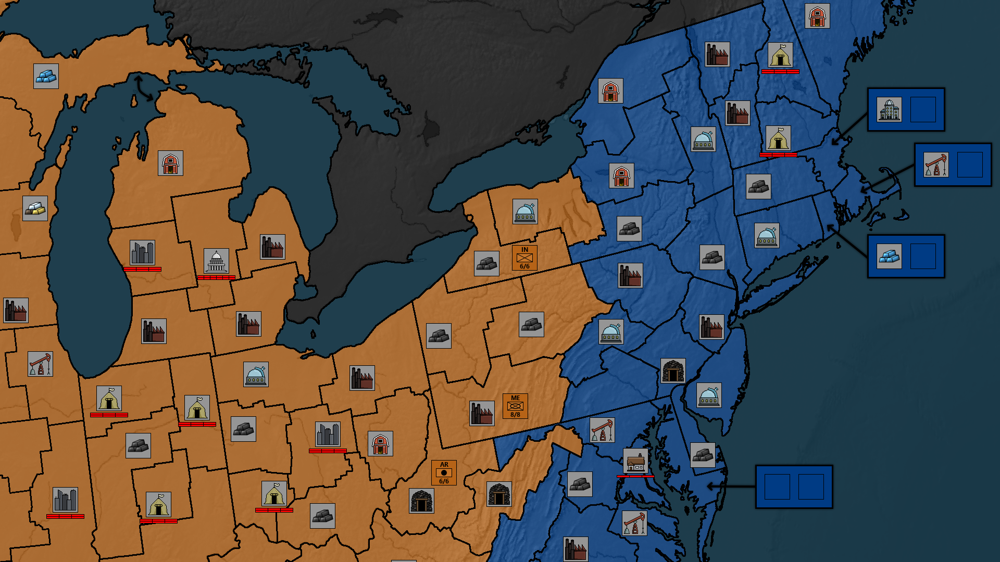

## Divided We Stand
NOTE - This repository is a prototype! It is meant to be run locally by a game administrator to manage games, process game turns, view completed games. This is not a production-ready website.

An online turn-based strategy game set in the modern era. Create your own unique nation out of the ashes of old and rebuild civilization in your image by expanding your territory and researching new technologies. Engage with other players in negotiation, trade, and diplomacy. Form grand alliances with those that share your vision, and wage war against those who dare to stand against you.

## About This Project

### Built With
* [Flask](https://flask.palletsprojects.com/en/stable/)
* [Pillow (PIL Fork)](https://pypi.org/project/pillow/)

### Roadmap

- [x] Rewrite Part 1 - Region Data Management
- [x] Update #9
- [x] Rewrite Part 2 - Nation Data Management & Map Code Rewrite
- [x] Update #10
- [x] Rewrite Part 3 - Game Management
- [x] Update #11
- [ ] Update #12

## Contact

Ian Hampton

Project Link: [https://github.com/ian-hampton/divided-we-stand-prototype](https://github.com/ian-hampton/divided-we-stand-prototype)

## Acknowledgments

Game maps use imagery provided by [Natural Earth](https://www.naturalearthdata.com/about/) and were created with the help of vector datasets from [Natural Earth](https://www.naturalearthdata.com/about/) and [GADM](https://gadm.org/).

Game improvement icons created by Kendal Hampton.

Site icons are from [iconify](https://iconify.design/about/) material symbols.